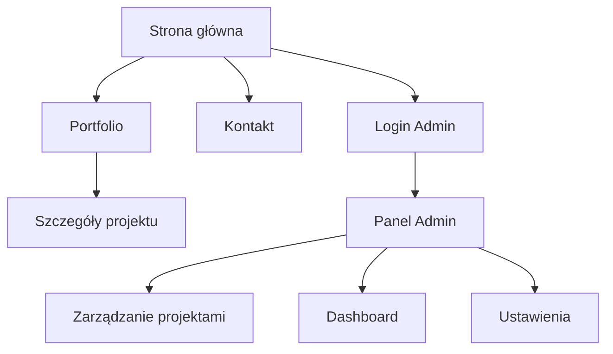

# Modernizacja Portfolio - Vite + React + TypeScript

## 1. Przegląd Projektu

Modernizacja istniejącego portfolio z HTML/CSS/JavaScript na nowoczesny stack technologiczny z Vite, React, TypeScript oraz przygotowanie infrastruktury dla panelu administratora z bazą danych.

**Główne cele:**

* Migracja na Vite + React + TypeScript

* Implementacja nowoczesnego, profesjonalnego designu

* Przygotowanie panelu administratora do zarządzania projektami

* Integracja z bazą danych

* Optymalizacja wydajności i SEO

## 2. Główne Funkcjonalności

### 2.1 Role Użytkowników

| Rola          | Metoda Dostępu   | Główne Uprawnienia                               |
| ------------- | ---------------- | ------------------------------------------------ |
| Odwiedzający  | Publiczny dostęp | Przeglądanie portfolio, kontakt                  |
| Administrator | Login + hasło    | Zarządzanie projektami, edycja treści, analityka |

### 2.2 Moduły Funkcjonalne

Nasz zmodernizowany projekt składa się z następujących głównych stron:

1. **Strona główna**: Hero section z animacjami, nawigacja, sekcja o mnie
2. **Portfolio**: Dynamiczna galeria projektów z filtrowaniem i szczegółami
3. **Panel administratora**: Dashboard, zarządzanie projektami, analityka
4. **Strona kontaktu**: Formularz kontaktowy z walidacją
5. **Strona logowania**: Bezpieczne logowanie dla administratora

### 2.3 Szczegóły Stron

| Nazwa Strony  | Nazwa Modułu           | Opis Funkcjonalności                                           |
| ------------- | ---------------------- | -------------------------------------------------------------- |
| Strona główna | Hero Section           | Animowane wprowadzenie z efektem pisania, particles background |
| Strona główna | Nawigacja              | Responsywna nawigacja z smooth scroll, mobile menu             |
| Strona główna | O mnie                 | Sekcja prezentująca umiejętności i doświadczenie               |
| Portfolio     | Galeria projektów      | Dynamiczne ładowanie projektów z bazy danych, filtry kategorii |
| Portfolio     | Szczegóły projektu     | Modal z pełnymi informacjami, galeria zdjęć, linki             |
| Panel admin   | Dashboard              | Statystyki odwiedzin, ostatnie projekty, szybkie akcje         |
| Panel admin   | Zarządzanie projektami | CRUD operacje na projektach, upload obrazów                    |
| Panel admin   | Ustawienia             | Konfiguracja strony, zmiana hasła                              |
| Kontakt       | Formularz              | Walidacja w czasie rzeczywistym, wysyłanie emaili              |
| Logowanie     | Autoryzacja            | Bezpieczne logowanie z JWT, reset hasła                        |

## 3. Główny Przepływ

**Przepływ dla odwiedzających:**
Użytkownik wchodzi na stronę główną → przegląda sekcje → klika portfolio → filtruje projekty → ogląda szczegóły → kontaktuje się przez formularz

**Przepływ dla administratora:**
Administrator loguje się → przechodzi do panelu → dodaje/edytuje projekty → zarządza treścią → sprawdza statystyki



## 4. Design UI/UX

### 4.1 Styl Designu

**Kolory:**

* Główny: #6366f1 (Indigo)

* Pomocniczy: #8b5cf6 (Violet)

* Tło: #0f172a (Slate 900)

* Tekst: #f8fafc (Slate 50)

* Akcent: #06b6d4 (Cyan)

**Typografia:**

* Główna: Inter (Google Fonts)

* Rozmiary: 14px (body), 16px (large), 24px (h3), 32px (h2), 48px (h1)

**Styl przycisków:**

* Gradient buttons z hover effects

* Rounded corners (8px)

* Shadow effects

* Smooth transitions (300ms)

**Layout:**

* Mobile-first responsive design

* Grid system z CSS Grid/Flexbox

* Card-based components

* Sticky navigation

**Ikony i animacje:**

* Lucide React icons

* Framer Motion animations

* Smooth scroll behavior

* Loading states

### 4.2 Przegląd Designu Stron

| Nazwa Strony  | Nazwa Modułu | Elementy UI                                                            |
| ------------- | ------------ | ---------------------------------------------------------------------- |
| Strona główna | Hero Section | Gradient background, typing animation, floating particles, CTA buttons |
| Strona główna | Nawigacja    | Glass morphism effect, smooth transitions, mobile hamburger menu       |
| Portfolio     | Galeria      | Masonry layout, hover effects, category filters, search bar            |
| Panel Admin   | Dashboard    | Cards z statystykami, wykresy, recent activity feed                    |
| Kontakt       | Formularz    | Floating labels, real-time validation, success animations              |

### 4.3 Responsywność

Projekt jest mobile-first z pełną responsywnością:

* Mobile: 320px - 768px

* Tablet: 768px - 1024px

* Desktop: 1024px+

* Touch-friendly na wszystkich urządzeniach

* Optymalizacja dla retina displays

## 5. Architektura Techniczna

### 5.1 Frontend Stack

* **Vite** - Build tool i dev server

* **React 18** - UI framework z hooks

* **TypeScript** - Type safety

* **Tailwind CSS** - Utility-first styling

* **Framer Motion** - Animations

* **React Router** - Client-side routing

* **React Hook Form** - Form handling

* **Zustand** - State management

### 5.2 Backend & Database

* **Node.js + Express** - API server

* **Prisma** - Database ORM

* **PostgreSQL** - Production database

* **JWT** - Authentication

* **Multer** - File uploads

* **Nodemailer** - Email sending

### 5.3 Struktura Projektu

```
src/
├── components/          # Reusable components
│   ├── ui/             # Basic UI components
│   ├── layout/         # Layout components
│   └── forms/          # Form components
├── pages/              # Page components
├── hooks/              # Custom hooks
├── store/              # Zustand stores
├── types/              # TypeScript types
├── utils/              # Utility functions
├── api/                # API calls
└── assets/             # Static assets
```

### 5.4 Database Schema

```sql
-- Projects table
CREATE TABLE projects (
  id SERIAL PRIMARY KEY,
  title VARCHAR(255) NOT NULL,
  description TEXT,
  technologies JSON,
  images JSON,
  github_url VARCHAR(255),
  live_url VARCHAR(255),
  category VARCHAR(100),
  featured BOOLEAN DEFAULT false,
  created_at TIMESTAMP DEFAULT NOW(),
  updated_at TIMESTAMP DEFAULT NOW()
);

-- Admin users table
CREATE TABLE admin_users (
  id SERIAL PRIMARY KEY,
  email VARCHAR(255) UNIQUE NOT NULL,
  password_hash VARCHAR(255) NOT NULL,
  created_at TIMESTAMP DEFAULT NOW()
);

-- Contact messages table
CREATE TABLE contact_messages (
  id SERIAL PRIMARY KEY,
  name VARCHAR(255) NOT NULL,
  email VARCHAR(255) NOT NULL,
  message TEXT NOT NULL,
  read BOOLEAN DEFAULT false,
  created_at TIMESTAMP DEFAULT NOW()
);
```

## 6. Plan Implementacji

### Faza 1: Setup i Konfiguracja

1. Inicjalizacja Vite + React + TypeScript
2. Konfiguracja Tailwind CSS
3. Setup ESLint + Prettier
4. Konfiguracja React Router

### Faza 2: Komponenty Podstawowe

1. Layout components (Header, Footer)
2. UI components (Button, Card, Modal)
3. Navigation z mobile menu
4. Loading states

### Faza 3: Strony Główne

1. Hero section z animacjami
2. About section
3. Portfolio gallery
4. Contact form

### Faza 4: Panel Administratora

1. Login system
2. Dashboard
3. Project management CRUD
4. File upload system

### Faza 5: Backend i Database

1. Express API setup
2. Database schema
3. Authentication middleware
4. File upload handling

### Faza 6: Optymalizacja

1. Performance optimization
2. SEO improvements
3. Error handling
4. Testing

## 7. Nowoczesne Funkcjonalności

* **Progressive Web App** - Service workers, offline support

* **Dark/Light mode** - Theme switching

* **Internationalization** - Multi-language support

* **Analytics** - Google Analytics 4 integration

* **Performance monitoring** - Core Web Vitals tracking

* **Accessibility** - WCAG 2.1 compliance

* **Security** - HTTPS, CSP headers, input sanitization

